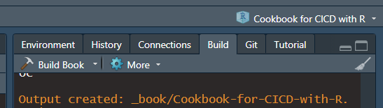

# Bookdown

## Bookdown

Quick how to set a github action for a bookdown deployment onto the **gh-pages** branch each time there is merge into the **main** (or **master**) branch using `r-lib` [bookdown.yaml](https://github.com/r-lib/actions/blob/v2-branch/examples/bookdown.yaml)

## Prerequisite

-   The action will require a *renv* environment.
-   Book to build (you can also use the faithful geyser example).

## Steps

-   Create your book using `renv` (The yaml use assume `renv` is used).

-   Try to build your book with the *Build Book* button on the *Build tab*. 

    -   While this step is not really necessary, it is to make sure your tests runs once and any further problems do not come from the tests.

-   Add the bookdown.yaml `usethis::use_github_action("bookdown")`

-   Push!

    -   There is no need to have the **gh-pages** set up beforehand. The action will set it up. If the the **gh-pages** branch is not set up, it will take some time to get it set up.
    -   There is no need to have the book build neither.
