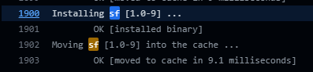
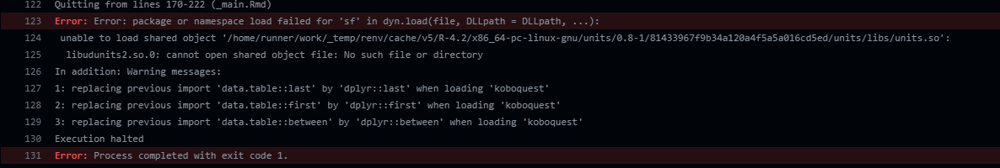

# Known issues

This chapter presents some of the issues encountered with renv and GitHub actions.

## Error 403 

It is possible that once you set your action, it will not run and you will get an error 403. Error
403 is usually link to a forbidden access error. It can look as below. It can happen if you changed ownership from a repository. 
```
remote: Permission to /ACCOUNT-NAME/REPO-NAME.git denied to github-actions[bot].
fatal: unable to access 'https://github.com/ACCOUNT-NAME/REPO-NAME/': The requested URL returned error: 403
```

To remediate to this, you need to change the workflow permission in your repository settings:
-  Settings -> Action -> General -> Workflow permissions [stackoverflow topic](https://stackoverflow.com/questions/73687176/permission-denied-to-github-actionsbot-the-requested-url-returned-error-403)


## renv and sf

While `sf` is installed correctly, it cannot be loaded into the machine. I have not found yet a solution.


